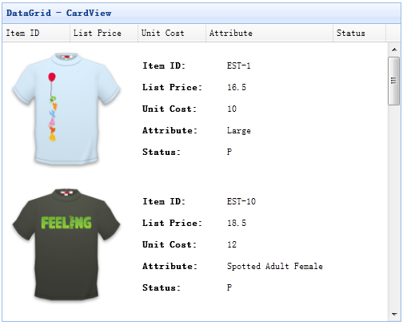

# jQuery EasyUI 数据网格 - 创建自定义视图

在不同的情况下，您可能需要为数据网格（datagrid）运用更灵活的布局。对于用户来说，卡片视图（Card View）是个不错的选择。这个工具可以在数据网格（datagrid）中迅速获取和显示数据。在数据网格（datagrid）的头部，您可以仅仅通过点击列的头部来排序数据。本教程将向您展示如何创建自定义卡片视图（Card View）。



#### 创建卡片视图（Card View）

从数据网格（datagrid）的默认视图继承，是个创建自定义视图的不错方法。我们将要创建一个卡片视图（Card View）来为每行显示一些信息。

```
	var cardview = $.extend({}, $.fn.datagrid.defaults.view, {
		renderRow: function(target, fields, frozen, rowIndex, rowData){
			var cc = [];
			cc.push('<td colspan=' + fields.length + ' style="padding:10px 5px;border:0;">');
			if (!frozen){
				var aa = rowData.itemid.split('-');
				var img = 'shirt' + aa[1] + '.gif';
				cc.push('');
				cc.push('<div style="float:left;margin-left:20px;">');
				for(var i=0; i<fields.length; i++){
					var copts = $(target).datagrid('getColumnOption', fields[i]);
					cc.push('<p><span class="c-label">' + copts.title + ':</span> ' + rowData[fields[i]] + '</p>');
				}
				cc.push('</div>');
			}
			cc.push('</td>');
			return cc.join('');
		}
	});

```

#### 创建数据网格（DataGrid）

现在我们使用视图创建数据网格（datagrid）。

```
	<table id="tt" style="width:500px;height:400px"
			title="DataGrid - CardView" singleSelect="true" fitColumns="true" remoteSort="false"
			url="datagrid8_getdata.php" pagination="true" sortOrder="desc" sortName="itemid">
		<thead>
			<tr>
				<th field="itemid" width="80" sortable="true">Item ID</th>
				<th field="listprice" width="80" sortable="true">List Price</th>
				<th field="unitcost" width="80" sortable="true">Unit Cost</th>
				<th field="attr1" width="150" sortable="true">Attribute</th>
				<th field="status" width="60" sortable="true">Status</th>
			</tr>
		</thead>
	</table>	

```

```
	$('#tt').datagrid({
		view: cardview
	});

```

请注意，我们设置 view 属性，且它的值为我们的卡片视图。

## 下载 jQuery EasyUI 实例

[jeasyui-datagrid-datagrid16.zip](/try/jeasyui/download/jeasyui-datagrid-datagrid16.zip)

 