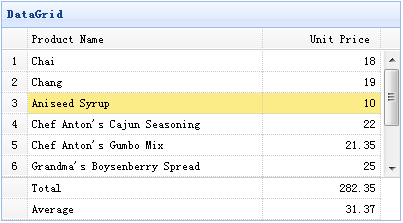

# jQuery EasyUI 数据网格 - 创建页脚摘要

在本教程中，我们将向您展示如何在数据网格（datagrid）页脚显示摘要信息行。



为了显示页脚行，您应该设置 showFooter 属性为 true，然后准备定义在数据网格（datagrid）数据中的页脚行。以下是示例数据：

```
	{"total":1,"rows":[{"id":1,"name":"Chai","price":18.00}],"footer":[{"name":"Total","price":18.00}]}

```

#### 创建数据网格（DataGrid）

```
	<table id="tt" title="DataGrid" class="easyui-datagrid" style="width:400px;height:250px"
			url="data/datagrid17_data.json"
			fitColumns="true" rownumbers="true" showFooter="true">
		<thead>
			<tr>
				<th field="name" width="80">Product Name</th>
				<th field="price" width="40" align="right">Unit Price</th>
			</tr>
		</thead>
	</table>

```

页脚行和显示数据行一样，所以您可以在页脚显示不止一个摘要信息。

## 下载 jQuery EasyUI 实例

[jeasyui-datagrid-datagrid17.zip](/try/jeasyui/download/jeasyui-datagrid-datagrid17.zip)

 