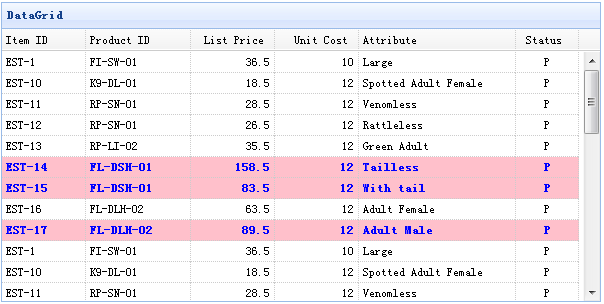

# jQuery EasyUI 数据网格 - 条件设置行背景颜色

本教程将向您展示如何根据一些条件改变数据网格（datagrid）组件的行样式。当 listprice 值大于 50 时，我们将为该行设置不同的颜色。



数据网格（datagrid）的 rowStyler 函数的设计目的是允许您自定义行样式。以下代码展示如何改变行样式：

```
	<table id="tt" title="DataGrid" style="width:600px;height:250px"
			url="data/datagrid_data.json"
			singleSelect="true" fitColumns="true">
		<thead>
			<tr>
				<th field="itemid" width="80">Item ID</th>
				<th field="productid" width="80">Product ID</th>
				<th field="listprice" width="80" align="right">List Price</th>
				<th field="unitcost" width="80" align="right">Unit Cost</th>
				<th field="attr1" width="150">Attribute</th>
				<th field="status" width="60" align="center">Stauts</th>
			</tr>
		</thead>
	</table>

```

```
	$('#tt').datagrid({
		rowStyler:function(index,row){
			if (row.listprice>50){
				return 'background-color:pink;color:blue;font-weight:bold;';
			}
		}
	});

```

正如您所看到的，我们根据一些条件设置 background-color（背景色）为 pink（粉红色），设置文本颜色为 blue（蓝色）。

## 下载 jQuery EasyUI 实例

[jeasyui-datagrid-datagrid18.zip](/try/jeasyui/download/jeasyui-datagrid-datagrid18.zip)

 