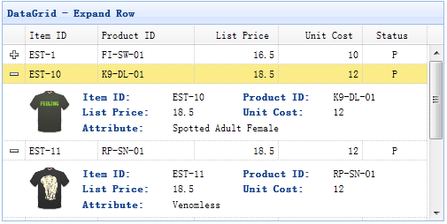

# jQuery EasyUI 数据网格 - 扩展行显示细节

数据网格（datagrid）可以改变它的视图（view）来显示不同的效果。使用详细视图，数据网格（datagrid）可以在数据行的左边显示展开按钮（"+" 或者 "-"）。用户可以展开行来显示附加的详细信息。



#### 步骤 1：创建数据网格（DataGrid）

```
	<table id="dg" style="width:500px;height:250px"
			url="datagrid8_getdata.php"
			pagination="true" sortName="itemid" sortOrder="desc"
			title="DataGrid - Expand Row"
			singleSelect="true" fitColumns="true">
		<thead>
			<tr>
				<th field="itemid" width="60">Item ID</th>
				<th field="productid" width="80">Product ID</th>
				<th field="listprice" align="right" width="70">List Price</th>
				<th field="unitcost" align="right" width="70">Unit Cost</th>
				<th field="status" width="50" align="center">Status</th>
			</tr>
		</thead>
	</table>

```

#### 步骤 2：为数据网格（DataGrid）设置详细视图

为了使用详细视图，请记得在页面头部引用视图脚本文件。

```
<script type="text/javascript" src="http://www.w3cschool.cc/try/jeasyui/datagrid-detailview.js"></script>

```

```
$('#dg').datagrid({
	view: detailview,
	detailFormatter:function(index,row){
		return '<div class="ddv" style="padding:5px 0"></div>';
	},
	onExpandRow: function(index,row){
		var ddv = $(this).datagrid('getRowDetail',index).find('div.ddv');
		ddv.panel({
			border:false,
			cache:false,
			href:'datagrid21_getdetail.php?itemid='+row.itemid,
			onLoad:function(){
				$('#dg').datagrid('fixDetailRowHeight',index);
			}
		});
		$('#dg').datagrid('fixDetailRowHeight',index);
	}
});

```

我们定义 'detailFormatter' 函数，告诉数据网格（datagrid）如何渲染详细视图。 在这种情况下,我们返回一个简单的 '&lt;div&gt;' 元素，它将充当详细内容的容器。 请注意，详细信息为空。当用户点击展开按钮（'+'）时，onExpandRow 事件将被触发。 所以我们可以写一些代码来加载 ajax 详细内容。 最后我们调用 'fixDetailRowHeight' 方法来固定当详细内容加载时的行高度。

#### 步骤 3：服务器端代码

datagrid21_getdetail.php

```
&lt;?php
	include_once 'conn.php';

	$itemid = mysql_real_escape_string($_REQUEST['itemid']);

	$rs = mysql_query("select * from item where itemid='$itemid'");
	$item = mysql_fetch_array($rs);
?&gt;

<table class="dv-table" border="0" style="width:100%;">
	<tr>
		<td rowspan="3" style="width:60px">
			&lt;?php
				$aa = explode('-',$itemid);
				$serno = $aa[1];
				$img = "images/shirt$serno.gif";
				echo "";
			?&gt;
		</td>
		<td class="dv-label">Item ID: </td>
		<td>&lt;?php echo $item['itemid'];?&gt;</td>
		<td class="dv-label">Product ID:</td>
		<td>&lt;?php echo $item['productid'];?&gt;</td>
	</tr>
	<tr>
		<td class="dv-label">List Price: </td>
		<td>&lt;?php echo $item['listprice'];?&gt;</td>
		<td class="dv-label">Unit Cost:</td>
		<td>&lt;?php echo $item['unitcost'];?&gt;</td>
	</tr>
	<tr>
		<td class="dv-label">Attribute: </td>
		<td colspan="3">&lt;?php echo $item['attr1'];?&gt;</td>
	</tr>
</table>

```

## 下载 jQuery EasyUI 实例

[jeasyui-datagrid-datagrid21.zip](/try/jeasyui/download/jeasyui-datagrid-datagrid21.zip)

 