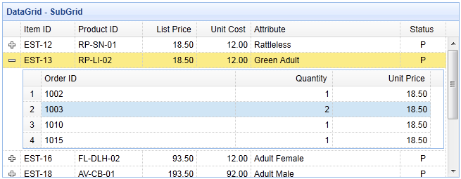

# jQuery EasyUI 数据网格 - 创建子网格

使用数据网格（datagrid）的详细视图，用户可以展开一行来显示附加的详细信息。 任何内容都可以加载作为行详细，子网格也可以动态加载。 本教程将向您展示如何在主网格上创建一个子网格。



#### 步骤 1：创建主网格

```
<table id="dg" style="width:700px;height:250px"
		url="datagrid22_getdata.php" 
		title="DataGrid - SubGrid"
		singleSelect="true" fitColumns="true">
	<thead>
		<tr>
			<th field="itemid" width="80">Item ID</th>
			<th field="productid" width="100">Product ID</th>
			<th field="listprice" align="right" width="80">List Price</th>
			<th field="unitcost" align="right" width="80">Unit Cost</th>
			<th field="attr1" width="220">Attribute</th>
			<th field="status" width="60" align="center">Status</th>
		</tr>
	</thead>
</table>

```

#### 步骤 2：设置详细视图来显示子网格

为了使用详细视图，请记得在页面头部引用视图脚本文件。

```
<script type="text/javascript" src="http://www.w3cschool.cc/try/jeasyui/datagrid-detailview.js"></script>

```

```
$('#dg').datagrid({
	view: detailview,
	detailFormatter:function(index,row){
		return '<div style="padding:2px"><table class="ddv"></table></div>';
	},
	onExpandRow: function(index,row){
		var ddv = $(this).datagrid('getRowDetail',index).find('table.ddv');
		ddv.datagrid({
			url:'datagrid22_getdetail.php?itemid='+row.itemid,
			fitColumns:true,
			singleSelect:true,
			rownumbers:true,
			loadMsg:'',
			height:'auto',
			columns:[[
				{field:'orderid',title:'Order ID',width:100},
				{field:'quantity',title:'Quantity',width:100},
				{field:'unitprice',title:'Unit Price',width:100}
			]],
			onResize:function(){
				$('#dg').datagrid('fixDetailRowHeight',index);
			},
			onLoadSuccess:function(){
				setTimeout(function(){
					$('#dg').datagrid('fixDetailRowHeight',index);
				},0);
			}
		});
		$('#dg').datagrid('fixDetailRowHeight',index);
	}
});

```

当用户点击展开按钮（'+'）时，'onExpandRow' 事件将被触发。 我们创建一个新的带有三列的子网格。 当子网格数据加载成功时或者改变尺寸大小时，请记得对主网格调用 'fixDetailRowHeight' 方法。

#### 步骤 3：服务器端代码

datagrid22_getdata.php

```
$result = array();

include 'conn.php';

$rs = mysql_query("select * from item where itemid in (select itemid from lineitem)");

$items = array();
while($row = mysql_fetch_object($rs)){
	array_push($items, $row);
}

echo json_encode($items);

```

datagrid22_getdetail.php

```
include 'conn.php';

$itemid = mysql_real_escape_string($_REQUEST['itemid']);

$rs = mysql_query("select * from lineitem where itemid='$itemid'");
$items = array();
while($row = mysql_fetch_object($rs)){
	array_push($items, $row);
}
echo json_encode($items);

```

## 下载 jQuery EasyUI 实例

[jeasyui-datagrid-datagrid22.zip](/try/jeasyui/download/jeasyui-datagrid-datagrid22.zip)

 