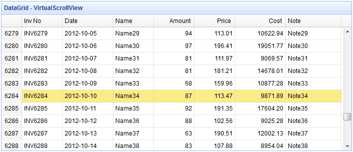

# jQuery EasyUI 数据网格 - 使用虚拟滚动视图显示海量数据

数据网格（datagrid）的虚拟滚动特性可以用来显示大数量的记录而不需要分页。 当滚动垂直滚动条时，数据网格（datagrid）执行 ajax 请求来加载和刷新现有的记录。 整个刷新的行为过程是平稳的没有闪烁。 在本教程中，我们将创建一个数据网格（datagrid），并运用虚拟滚动特性从服务器加载数据。



#### 创建数据网格（DataGrid）

为数据网格（datagrid）运用虚拟滚动特性，'view' 属性应该设置为 'scrollview'。 用户应该从数据网格（datagrid）扩展下载 scrollview，并在页面头部引用 scrollview 文件。

```
<script type="text/javascript" src="http://www.w3cschool.cc/try/jeasyui/datagrid-detailview.js"></script>

```

```
<table id="tt" class="easyui-datagrid" style="width:700px;height:300px"
		title="DataGrid - VirtualScrollView"
		data-options="view:scrollview,rownumbers:true,singleSelect:true,
			url:'datagrid27_getdata.php',autoRowHeight:false,pageSize:50">
	<thead>
		<tr>
			<th field="inv" width="80">Inv No</th>
			<th field="date" width="100">Date</th>
			<th field="name" width="80">Name</th>
			<th field="amount" width="80" align="right">Amount</th>
			<th field="price" width="80" align="right">Price</th>
			<th field="cost" width="100" align="right">Cost</th>
			<th field="note" width="110">Note</th>
		</tr>
	</thead>
</table>

```

请注意，这里我们不需要使用 pagination 属性，但 pageSize 属性是必需的，这样执行 ajax 请求时，数据网格（datagrid）将从服务器获取指定数量的记录。

#### 服务器端代码

datagrid27_getdata.php

```
$page = isset($_POST['page']) ? intval($_POST['page']) : 1;
$rows = isset($_POST['rows']) ? intval($_POST['rows']) : 50;

$items = array();
date_default_timezone_set('UTC');
for($i=1; $i<=$rows; $i++){
	$index = $i+($page-1)*$rows;
	$amount = rand(50,100);
	$price = rand(10000,20000)/100;
	$items[] = array(
		'inv' => sprintf("INV%04d",$index),
		'date' => date('Y-m-d',time()+24*3600*$i),
		'name' => 'Name' . $index,
		'note' => 'Note' . $index,
		'amount' => $amount,
		'price' => sprintf('%01.2f',$price),
		'cost' => sprintf('%01.2f',$amount*$price)
	);
}
$result = array();
$result['total'] = 8000;
$result['rows'] = $items;
echo json_encode($result);

```

## 下载 jQuery EasyUI 实例

[jeasyui-datagrid-datagrid27.zip](/try/jeasyui/download/jeasyui-datagrid-datagrid27.zip)

 