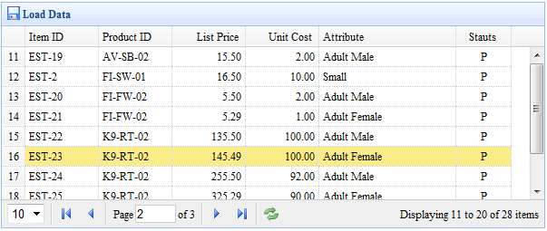

# jQuery EasyUI 数据网格 - 添加分页组件

本实例演示如何从服务器端加载数据，如何添加分页组件（pagination）到数据网格（datagrid）。



#### 创建数据网格（DataGrid）

为了从远程服务器端加载数据，您应该设置 'url' 属性，在您的服务器端应该返回 JSON 格式数据。请看数据网格（datagrid）文档得到更多关于它的数据格式信息。

```
	<table id="tt" class="easyui-datagrid" style="width:600px;height:250px"
			url="datagrid2_getdata.php"
			title="Load Data" iconCls="icon-save"
			rownumbers="true" pagination="true">
		<thead>
			<tr>
				<th field="itemid" width="80">Item ID</th>
				<th field="productid" width="80">Product ID</th>
				<th field="listprice" width="80" align="right">List Price</th>
				<th field="unitcost" width="80" align="right">Unit Cost</th>
				<th field="attr1" width="150">Attribute</th>
				<th field="status" width="60" align="center">Stauts</th>
			</tr>
		</thead>
	</table>

```

我们定义数据网格（datagrid）列，并设置 'pagination' 属性为 true，它将在数据网格（datagrid）的底部生成一个分页（pagination）工具栏。pagination将发送两个参数到服务器：

*   page：页码，起始值 1。
*   rows：每页显示行。

#### 服务器端代码

```
	$page = isset($_POST['page']) ? intval($_POST['page']) : 1;
	$rows = isset($_POST['rows']) ? intval($_POST['rows']) : 10;
	// ...
	$rs = mysql_query("select count(*) from item");
	$row = mysql_fetch_row($rs);
	$result["total"] = $row[0];

	$rs = mysql_query("select * from item limit $offset,$rows");

	$items = array();
	while($row = mysql_fetch_object($rs)){
		array_push($items, $row);
	}
	$result["rows"] = $items;

	echo json_encode($result);

```

## 下载 jQuery EasyUI 实例

[jeasyui-datagrid-datagrid2.zip](/try/jeasyui/download/jeasyui-datagrid-datagrid2.zip)

 