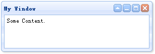
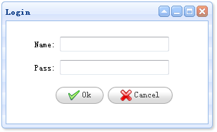

# jQuery EasyUI 窗口 - 创建简单窗口

创建一个窗口（window）非常简单，我们创建一个 DIV 标记：

```
<div id="win" class="easyui-window" title="My Window" style="width:300px;height:100px;padding:5px;">
	Some Content.
</div>

```

现在运行测试页面，您会看见一个窗口（window）显示在您的屏幕上。我们不需要写任何的 javascript 代码。



如果您希望创建一个隐藏的窗口（window），记得设置 'closed' 属性为 'true' 值，您可以调用 'open' 方法来打开窗口（window）：

```
<div id="win" class="easyui-window" title="My Window" closed="true" style="width:300px;height:100px;padding:5px;">
	Some Content.
</div>

```

```
$('#win').window('open');

```

作为最后的实例演示，我们创建一个登录窗口（window）：

```
<div id="win" class="easyui-window" title="Login" style="width:300px;height:180px;">
	<form style="padding:10px 20px 10px 40px;">
		<p>Name: <input type="text"></p>
		<p>Pass: <input type="password"></p>
		<div style="padding:5px;text-align:center;">
			<a href="#" class="easyui-linkbutton" icon="icon-ok">Ok</a>
			<a href="#" class="easyui-linkbutton" icon="icon-cancel">Cancel</a>
		</div>
	</form>
</div>

```



## 下载 jQuery EasyUI 实例

[jeasyui-win-win1.zip](/try/jeasyui/download/jeasyui-win-win1.zip)

 