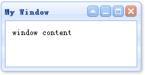
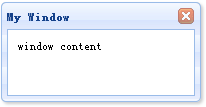
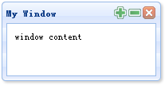

# jQuery EasyUI 窗口 - 自定义窗口工具栏

默认情况下，窗口（window）有四个工具：collapsible、minimizable、maximizable 和 closable。比如我们定义以下窗口（window）：

```
	<div id="win" class="easyui-window" title="My Window" style="padding:10px;width:200px;height:100px;">
		window content
	</div>

```



如需自定义工具，设置该工具为 true 或者 false。比如我们希望定义一个窗口（window），仅仅拥有一个可关闭的工具。您应该设置任何其他工具为 false。我们可以在标记中或者通过 jQuery 代码定义 tools 属性。现在我们使用 jQuery 代码来定义窗口（window）：

```
	$('#win').window({
		collapsible:false,
		minimizable:false,
		maximizable:false
	});

```



如果我们希望添加自定义的工具到窗口（window），我们可以使用 tools 属性。作为实例演示，我们添加两个工具到窗口（window）：

```
	$('#win').window({
		collapsible:false,
		minimizable:false,
		maximizable:false,
		tools:[{
			iconCls:'icon-add',
			handler:function(){
				alert('add');
			}
		},{
			iconCls:'icon-remove',
			handler:function(){
				alert('remove');
			}
		}]
	});

```



## 下载 jQuery EasyUI 实例

[jeasyui-win-win2.zip](/try/jeasyui/download/jeasyui-win-win2.zip)

 