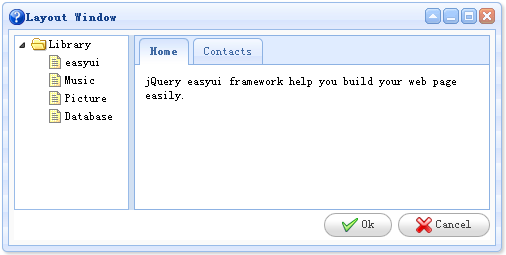

# jQuery EasyUI 窗口 - 窗口与布局

Layout 组件可以内嵌在窗口（window）中。我们可以创建一个复杂的布局窗口，甚至不需要写任何的 js 代码。jquery-easyui 框架帮我们在后台做渲染和调整尺寸。

作为一个实例，我们创建一个窗口（window），它包含两个部分，一个放置在左边一个放置在右边。在窗口（window）的左边我们创建一个树形菜单（tree），在窗口（window）的右边我们创建一个 tabs 容器。



```
	<div class="easyui-window" title="Layout Window" icon="icon-help" style="width:500px;height:250px;padding:5px;background: #fafafa;">
		<div class="easyui-layout" fit="true">
			<div region="west" split="true" style="width:120px;">
				<ul class="easyui-tree">
					<li>
						<span>Library</span>
						<ul>
							<li><span>easyui</span></li>
							<li><span>Music</span></li>
							<li><span>Picture</span></li>
							<li><span>Database</span></li>
						</ul>
					</li>
				</ul>
			</div>
			<div region="center" border="false" border="false">
				<div class="easyui-tabs" fit="true">
					<div title="Home" style="padding:10px;">
						jQuery easyui framework help you build your web page easily.
					</div>
					<div title="Contacts">
						No contact data.
					</div>
				</div>
			</div>
			<div region="south" border="false" style="text-align:right;height:30px;line-height:30px;">
				<a class="easyui-linkbutton" icon="icon-ok" href="javascript:void(0)">Ok</a>
				<a class="easyui-linkbutton" icon="icon-cancel" href="javascript:void(0)">Cancel</a>
			</div>
		</div>
	</div>

```

请看上面的代码，我们仅仅使用了 HTML 标记，一个复杂的布局窗口（window）将显示。这就是 jquery-easyui 框架，简单而强大。

## 下载 jQuery EasyUI 实例

[jeasyui-win-win3.zip](/try/jeasyui/download/jeasyui-win-win3.zip)

 