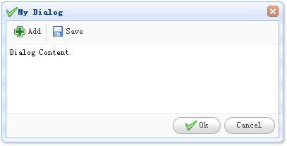

# jQuery EasyUI 窗口 - 创建对话框

对话框（Dialog）是一个特殊的窗口（window），可以包含在顶部的工具栏和在底部的按钮。默认情况下，对话框（Dialog）不能改变大小，但是用户可以设置 resizable 属性为 true，使其可以改变大小。



#### 创建对话框（Dialog）

对话框（Dialog）非常简单，可以从 DIV 标记创建，如下所示：

```
	<div id="dd" class="easyui-dialog" style="padding:5px;width:400px;height:200px;"
			title="My Dialog" iconCls="icon-ok"
			toolbar="#dlg-toolbar" buttons="#dlg-buttons">
		Dialog Content.
	</div>

```

#### 准备工具栏（Toolbar）和按钮（Button）

```
	<div id="dlg-toolbar">
		<a href="#" class="easyui-linkbutton" iconCls="icon-add" plain="true" onclick="javascript:alert('Add')">Add</a>
		<a href="#" class="easyui-linkbutton" iconCls="icon-save" plain="true" onclick="javascript:alert('Save')">Save</a>
	</div>
	<div id="dlg-buttons">
		<a href="#" class="easyui-linkbutton" iconCls="icon-ok" onclick="javascript:alert('Ok')">Ok</a>
		<a href="#" class="easyui-linkbutton" iconCls="icon-cancel" onclick="javascript:$('#dd').dialog('close')">Cancel</a>
	</div>

```

上面的代码我们创建了一个带有工具栏（toolbar）和按钮（button）的对话框（dialog）。这是对话框（dialog）、工具栏（toolbar）、内容（content）和按钮（buttons）的标准配置。

## 下载 jQuery EasyUI 实例

[jeasyui-win-dlg1.zip](/try/jeasyui/download/jeasyui-win-dlg1.zip)

 