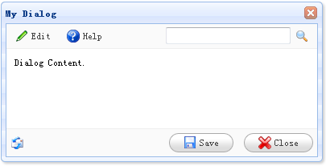

# jQuery EasyUI 窗口 - 自定义带有工具条和按钮的对话框

您可以创建一个带有工具栏（toolbar）和按钮（button）的对话框（dialog），可以从 HTML 标记创建。这个教程描述如何添加工具栏（toolbar）和按钮（button）到对话框（dialog），没有任何的 javascript 代码。



#### 创建对话框（Dialog）

```
	<div id="dd" class="easyui-dialog" title="My Dialog" style="width:400px;height:200px;padding:10px"
			toolbar="#dlg-toolbar" buttons="#dlg-buttons">
		Dialog Content.
	</div>

```

#### 创建工具栏（Toolbar）

```
	<div id="dlg-toolbar">
		<table cellpadding="0" cellspacing="0" style="width:100%">
			<tr>
				<td>
					<a href="#" class="easyui-linkbutton" iconCls="icon-edit" plain="true">Edit</a>
					<a href="#" class="easyui-linkbutton" iconCls="icon-help" plain="true">Help</a>
				</td>
				<td style="text-align:right">
					<input></input><a href="#" class="easyui-linkbutton" iconCls="icon-search" plain="true"></a>
				</td>
			</tr>
		</table>
	</div>

```

#### 创建按钮（Buttons）

```
	<div id="dlg-buttons">
		<table cellpadding="0" cellspacing="0" style="width:100%">
			<tr>
				<td>
					
				</td>
				<td style="text-align:right">
					<a href="#" class="easyui-linkbutton" iconCls="icon-save" onclick="javascript:alert('save')">Save</a>
					<a href="#" class="easyui-linkbutton" iconCls="icon-cancel" onclick="javascript:$('#dd').dialog('close')">Close</a>
				</td>
			</tr>
		</table>
	</div>

```

请注意，对话框（dialog）的工具栏（toolbar）和按钮（buttons）属性也可以通过 string 值指定，它将充当作为一个选择器去选择一个适当的 DIV 元素，并追加到工具栏（toolbar）或者按钮（buttons）的位置。

## 下载 jQuery EasyUI 实例

[jeasyui-win-dlg2.zip](/try/jeasyui/download/jeasyui-win-dlg2.zip)

 