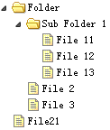

# jQuery EasyUI 树形菜单 - 使用标记创建树形菜单

一个树形菜单（Tree）可以从标记创建。easyui 树形菜单（Tree）也可以定义在 &lt;ul&gt; 元素中。无序列表的 &lt;ul&gt; 元素提供一个基础的树（Tree）结构。每一个 &lt;li&gt; 元素将产生一个树节点，子 &lt;ul&gt; 元素将产生一个父树节点。



#### 创建树形菜单（Tree）

```
	<ul class="easyui-tree">
        <li>
            <span>Folder</span>
            <ul>
                <li>
                    <span>Sub Folder 1</span>
                    <ul>
                        <li><span>File 11</span></li>
                        <li><span>File 12</span></li>
                        <li><span>File 13</span></li>
                    </ul>
                </li>
                <li><span>File 2</span></li>
                <li><span>File 3</span></li>
            </ul>
        </li>
        <li><span>File21</span></li>
    </ul>

```

## 下载 jQuery EasyUI 实例

[jeasyui-tree-tree1.zip](/try/jeasyui/download/jeasyui-tree-tree1.zip)

 