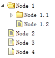

# jQuery EasyUI 树形菜单 - 创建异步树形菜单

为了创建异步的树形菜单（Tree），每一个树节点必须要有一个 'id' 属性，这个将提交回服务器去检索子节点数据。



#### 创建树形菜单（Tree）

```
	<ul id="tt" class="easyui-tree"
			url="tree2_getdata.php">
	</ul>

```

#### 服务器端代码

```
	$id = isset($_POST['id']) ? intval($_POST['id']) : 0;

	include 'conn.php';

	$result = array();
	$rs = mysql_query("select * from nodes where parentId=$id");
	while($row = mysql_fetch_array($rs)){
		$node = array();
		$node['id'] = $row['id'];
		$node['text'] = $row['name'];
		$node['state'] = has_child($row['id']) ? 'closed' : 'open';
		array_push($result,$node);
	}

	echo json_encode($result);

	function has_child($id){
		$rs = mysql_query("select count(*) from nodes where parentId=$id");
		$row = mysql_fetch_array($rs);
		return $row[0] > 0 ? true : false;
	}

```

## 下载 jQuery EasyUI 实例

[jeasyui-tree-tree2.zip](/try/jeasyui/download/jeasyui-tree-tree2.zip)

 