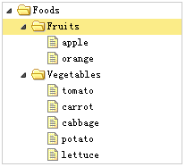
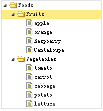

# jQuery EasyUI 树形菜单 - 树形菜单添加节点

本教程向您展示如何附加节点到树形菜单（Tree）。我们将创建一个包含水果和蔬菜节点的食品树，然后添加一些其他水果到已存在的水果节点。



#### 创建食品树

首先，我们创建食品树，代码如下所示：

```
	<div style="width:200px;height:auto;border:1px solid #ccc;">
		<ul id="tt" class="easyui-tree" url="tree_data.json"></ul>
	</div>

```

请注意，树（Tree)组件是定义在 &lt;ul&gt; 标记中，树节点数据从 URL "tree_data.json" 加载。

#### 得到父节点

然后我们通过点击节点选择水果节点，我们将添加一些其他的水果数据。执行 getSelected 方法得到处理节点：

```
	var node = $('#tt').tree('getSelected');

```

getSelected 方法的返回结果是一个 javascript 对象，它有一个 id、text、target 属性。target 属性是一个 DOM 对象，引用选中节点，它的 append 方法将用于附加子节点。

#### 附加节点

```
	var node = $('#tt').tree('getSelected');
	if (node){
		var nodes = [{
			"id":13,
			"text":"Raspberry"
		},{
			"id":14,
			"text":"Cantaloupe"
		}];
		$('#tt').tree('append', {
			parent:node.target,
			data:nodes
		});
	}

```

当添加一些水果，您将看见：



正如您所看到的，使用 easyui 的树（Tree）插件去附加节点不是那么的难。

## 下载 jQuery EasyUI 实例

[jeasyui-tree-tree3.zip](/try/jeasyui/download/jeasyui-tree-tree3.zip)

 