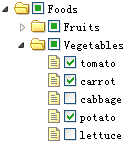

# jQuery EasyUI 树形菜单 - 创建带复选框的树形菜单

easyui 的树（Tree）插件允许您创建一个复选框树。如果您点击一个节点的复选框，这个点击的节点信息将向上和向下继承。例如：点击 'tomato' 节点的复选框，您将会看见 'Vegetables' 节点现在仅仅选中部分。



#### 创建复选框树

```
	<ul id="tt" class="easyui-tree"
			url="data/tree_data.json"
			checkbox="true">
	</ul>

```

## 下载 jQuery EasyUI 实例

[jeasyui-tree-tree4.zip](/try/jeasyui/download/jeasyui-tree-tree4.zip)

 