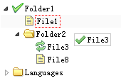

# jQuery EasyUI 树形菜单 - 树形菜单拖放控制

当在一个应用中使用树（Tree）插件，拖拽（drag）和放置（drop）功能要求允许用户改变节点位置。启用拖拽（drag）和放置（drop）操作，所有您需要做的就是把树（Tree）插件的 'dnd' 属性设置为 true。



#### 创建树形菜单（Tree）

```
	$('#tt').tree({
		dnd: true,
		url: 'tree_data.json'
	});

```

当在一个树节点上发生放置操作，'onDrop' 事件将被触发，您应该做一些或更多的操作，例如保存节点状态到远程服务器端，等等。

```
	onDrop: function(targetNode, source, point){
        var targetId = $(target).tree('getNode', targetNode).id;
        $.ajax({
            url: '...',
            type: 'post',
            dataType: 'json',
            data: {
                id: source.id,
                targetId: targetId,
                point: point
            }
        });
    }

```

## 下载 jQuery EasyUI 实例

[jeasyui-tree-tree5.zip](/try/jeasyui/download/jeasyui-tree-tree5.zip)

 