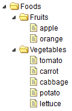

# jQuery EasyUI 树形菜单 - 树形菜单加载父/子节点

通常表示一个树节点的方式就是在每一个节点存储一个 parentid。 这个也被称为邻接列表模型。 直接加载这些数据到树形菜单（Tree）是不允许的。 但是我们可以在加载树形菜单之前，把它转换为标准标准的树形菜单（Tree）数据格式。 树（Tree）插件提供一个 'loadFilter' 选项函数，它可以实现这个功能。 它提供一个机会来改变任何一个进入数据。 本教程向您展示如何使用 'loadFilter' 函数加载父/子节点到树形菜单（Tree）。



#### 父/子节点数据

```
	[
	{"id":1,"parendId":0,"name":"Foods"},
	{"id":2,"parentId":1,"name":"Fruits"},
	{"id":3,"parentId":1,"name":"Vegetables"},
	{"id":4,"parentId":2,"name":"apple"},
	{"id":5,"parentId":2,"name":"orange"},
	{"id":6,"parentId":3,"name":"tomato"},
	{"id":7,"parentId":3,"name":"carrot"},
	{"id":8,"parentId":3,"name":"cabbage"},
	{"id":9,"parentId":3,"name":"potato"},
	{"id":10,"parentId":3,"name":"lettuce"}
	]

```

#### 使用 'loadFilter' 创建树形菜单（Tree）

```
	$('#tt').tree({
		url: 'data/tree6_data.json',
		loadFilter: function(rows){
			return convert(rows);
		}
	});

```

#### 转换的实现

```
	function convert(rows){
		function exists(rows, parentId){
			for(var i=0; i<rows.length; i++){
				if (rows[i].id == parentId) return true;
			}
			return false;
		}

		var nodes = [];
		// get the top level nodes
		for(var i=0; i<rows.length; i++){
			var row = rows[i];
			if (!exists(rows, row.parentId)){
				nodes.push({
					id:row.id,
					text:row.name
				});
			}
		}

		var toDo = [];
		for(var i=0; i<nodes.length; i++){
			toDo.push(nodes[i]);
		}
		while(toDo.length){
			var node = toDo.shift();	// the parent node
			// get the children nodes
			for(var i=0; i<rows.length; i++){
				var row = rows[i];
				if (row.parentId == node.id){
					var child = {id:row.id,text:row.name};
					if (node.children){
						node.children.push(child);
					} else {
						node.children = [child];
					}
					toDo.push(child);
				}
			}
		}
		return nodes;
	}

```

## 下载 jQuery EasyUI 实例

[jeasyui-tree-tree6.zip](/try/jeasyui/download/jeasyui-tree-tree6.zip)

 