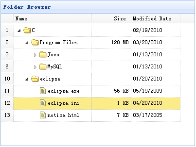

# jQuery EasyUI 树形菜单 - 创建基础树形网格

树形网格（TreeGrid）组件从数据网格（DataGrid）继承，但是允许在行之间存在父/子节点关系。许多属性继承至数据网格（DataGrid），可以用在树形网格（TreeGrid）中。为了使用树形网格（TreeGrid），用户必须定义 'treeField' 属性，指明哪个字段作为树节点。

本教程将向您展示如何使用树形网格（TreeGrid）组件设置一个文件夹浏览。



#### 创建树形网格（TreeGrid）

```
	<table id="test" title="Folder Browser" class="easyui-treegrid" style="width:400px;height:300px"
			url="data/treegrid_data.json"
			rownumbers="true"
			idField="id" treeField="name">
		<thead>
			<tr>
				<th field="name" width="160">Name</th>
				<th field="size" width="60" align="right">Size</th>
				<th field="date" width="100">Modified Date</th>
			</tr>
		</thead>
	</table>

```

## 下载 jQuery EasyUI 实例

[jeasyui-tree-treegrid1.zip](/try/jeasyui/download/jeasyui-tree-treegrid1.zip)

 