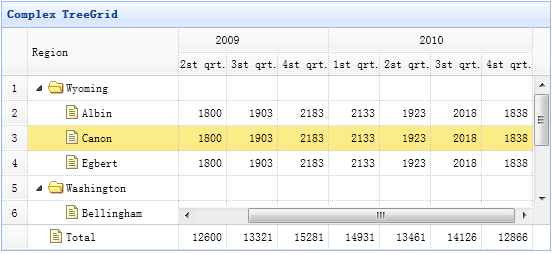

# jQuery EasyUI 树形菜单 - 创建复杂树形网格

树形网格（TreeGrid）可以展示有限空间上带有多列和复杂数据电子表格。本教程将演示如何将表格数据排列在分割的网格和多行表头中，以便组织共同的数据。



#### 创建树形网格（TreeGrid）

```
	<table title="Complex TreeGrid" class="easyui-treegrid" style="width:550px;height:250px"
			url="data/treegrid2_data.json"
			rownumbers="true" showFooter="true"
			idField="id" treeField="region">
		<thead frozen="true">
			<tr>
				<th field="region" width="150">Region</th>
			</tr>
		</thead>
		<thead>
			<tr>
				<th colspan="4">2009</th>
				<th colspan="4">2010</th>
			</tr>
			<tr>
				<th field="f1" width="50" align="right">1st qrt.</th>
				<th field="f2" width="50" align="right">2st qrt.</th>
				<th field="f3" width="50" align="right">3st qrt.</th>
				<th field="f4" width="50" align="right">4st qrt.</th>
				<th field="f5" width="50" align="right">1st qrt.</th>
				<th field="f6" width="50" align="right">2st qrt.</th>
				<th field="f7" width="50" align="right">3st qrt.</th>
				<th field="f8" width="50" align="right">4st qrt.</th>
			</tr>
		</thead>
	</table>

```

正如您所看到的，树形网格（Treegrid）的使用和数据网格（Datagrid）一样。请使用 'frozen' 属性来定义冻结列，列的 'colspan' 和 'rowspan' 属性来定义多行表头。

## 下载 jQuery EasyUI 实例

[jeasyui-tree-treegrid2.zip](/try/jeasyui/download/jeasyui-tree-treegrid2.zip)

 