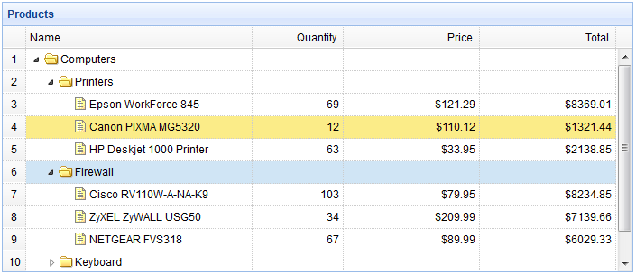

# jQuery EasyUI 树形菜单 - 树形网格动态加载

动态加载树形网格有助于从服务器上加载部分的行数据，避免加载大型数据的长时间等待。本教程将向您展示如何创建带有动态加载特性的树形网格（TreeGrid）。



#### 创建树形网格（TreeGrid）

```
	<table title="Products" class="easyui-treegrid" style="width:700px;height:300px"
			url="treegrid3_getdata.php"
			rownumbers="true"
			idField="id" treeField="name">
		<thead>
			<tr>
				<th field="name" width="250">Name</th>
				<th field="quantity" width="100" align="right">Quantity</th>
				<th field="price" width="150" align="right" formatter="formatDollar">Price</th>
				<th field="total" width="150" align="right" formatter="formatDollar">Total</th>
			</tr>
		</thead>
	</table>

```

#### 服务器端代码

treegrid3_getdata.php

```
$id = isset($_POST['id']) ? intval($_POST['id']) : 0;

include 'conn.php';
$result = array();
$rs = mysql_query("select * from products where parentId=$id");
while($row = mysql_fetch_array($rs)){
	$row['state'] = has_child($row['id']) ? 'closed' : 'open';
	$row['total'] = $row['price']*$row['quantity'];
	array_push($result, $row);
}

echo json_encode($result);

function has_child($id){
	$rs = mysql_query("select count(*) from products where parentId=$id");
	$row = mysql_fetch_array($rs);
	return $row[0] > 0 ? true : false;
}

```

## 下载 jQuery EasyUI 实例

[jeasyui-tree-treegrid3.zip](/try/jeasyui/download/jeasyui-tree-treegrid3.zip)

 