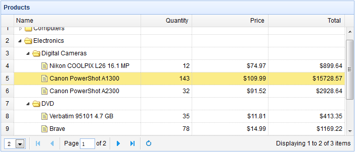

# jQuery EasyUI 树形菜单 - 树形网格添加分页

本教程展示如何向带有动态加载特性的树形网格（TreeGrid）添加分页。



#### 创建树形网格（TreeGrid）

启用树形网格（TreeGrid）的分页特性，必须添加 'pagination:true' 属性，这样页面加载时就会向服务器发送 'page' 和 'rows' 参数。

```
	<table title="Products" class="easyui-treegrid" style="width:700px;height:300px"
			data-options="
				url: 'treegrid4_getdata.php',
				rownumbers: true,
				pagination: true,
				pageSize: 2,
				pageList: [2,10,20],
				idField: 'id',
				treeField: 'name',
				onBeforeLoad: function(row,param){
					if (!row) {	// load top level rows
						param.id = 0;	// set id=0, indicate to load new page rows
					}
				}
			">
		<thead>
			<tr>
				<th field="name" width="250">Name</th>
				<th field="quantity" width="100" align="right">Quantity</th>
				<th field="price" width="150" align="right" formatter="formatDollar">Price</th>
				<th field="total" width="150" align="right" formatter="formatDollar">Total</th>
			</tr>
		</thead>
	</table>

```

#### 服务器端代码

treegrid4_getdata.php

```
$page = isset($_POST['page']) ? intval($_POST['page']) : 1;
$rows = isset($_POST['rows']) ? intval($_POST['rows']) : 10;
$offset = ($page-1)*$rows;

$id = isset($_POST['id']) ? intval($_POST['id']) : 0;

include 'conn.php';

$result = array();
if ($id == 0){
	$rs = mysql_query("select count(*) from products where parentId=0");
	$row = mysql_fetch_row($rs);
	$result["total"] = $row[0];

	$rs = mysql_query("select * from products where parentId=0 limit $offset,$rows");
	$items = array();
	while($row = mysql_fetch_array($rs)){
		$row['state'] = has_child($row['id']) ? 'closed' : 'open';
		array_push($items, $row);
	}
	$result["rows"] = $items;
} else {
	$rs = mysql_query("select * from products where parentId=$id");
	while($row = mysql_fetch_array($rs)){
		$row['state'] = has_child($row['id']) ? 'closed' : 'open';
		$row['total'] = $row['price']*$row['quantity'];
		array_push($result, $row);
	}
}

echo json_encode($result);

function has_child($id){
	$rs = mysql_query("select count(*) from products where parentId=$id");
	$row = mysql_fetch_array($rs);
	return $row[0] > 0 ? true : false;
}

```

发送到服务器的参数包括：

*   page：要加载的当前页面。
*   rows：页面尺寸大小。
*   id：父行的 id 值，从服务器返回的行将被添加。

当展开一个行节点时，'id' 值是大于 0 的。 当改变页码时，'id' 值应该被设置为 0 来放置加载子行。

## 下载 jQuery EasyUI 实例

[jeasyui-tree-treegrid4.zip](/try/jeasyui/download/jeasyui-tree-treegrid4.zip)

 