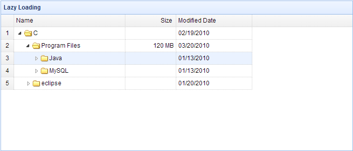

# jQuery EasyUI 树形菜单 - 树形网格惰性加载节点

有时我们已经得到充分的分层树形网格（TreeGrid）的数据。 我们还想让树形网格（TreeGrid）按层次惰性加载节点。 首先，只加载顶层节点。 然后点击节点的展开图标来加载它的子节点。 本教程展示如何创建带有惰性加载特性的树形网格（TreeGrid）。



#### 创建树形网格（TreeGrid）

```
	<table id="test" title="Folder Browser" class="easyui-treegrid" style="width:700px;height:300px"
			data-options="
				url: 'data/treegrid_data.json',
				method: 'get',
				rownumbers: true,
				idField: 'id',
				treeField: 'name',
				loadFilter: myLoadFilter
			">
		<thead>
			<tr>
				<th field="name" width="220">Name</th>
				<th field="size" width="100" align="right">Size</th>
				<th field="date" width="150">Modified Date</th>
			</tr>
		</thead>
	</table>

```

为了放置加载子节点，我们需要为每个节点重命名 'children' 属性。 正如下面的代码所示，'children' 属性重命名为 'children1'。 当展开一个节点时，我们调用 'append' 方法来加载它的子节点数据。

#### 'loadFilter' 代码

```
	function myLoadFilter(data,parentId){
		function setData(){
			var todo = [];
			for(var i=0; i<data.length; i++){
				todo.push(data[i]);
			}
			while(todo.length){
				var node = todo.shift();
				if (node.children){
					node.state = 'closed';
					node.children1 = node.children;
					node.children = undefined;
					todo = todo.concat(node.children1);
				}
			}
		}

		setData(data);
		var tg = $(this);
		var opts = tg.treegrid('options');
		opts.onBeforeExpand = function(row){
			if (row.children1){
				tg.treegrid('append',{
					parent: row[opts.idField],
					data: row.children1
				});
				row.children1 = undefined;
				tg.treegrid('expand', row[opts.idField]);
			}
			return row.children1 == undefined;
		};
		return data;
	}

```

## 下载 jQuery EasyUI 实例

[jeasyui-tree-treegrid5.zip](/try/jeasyui/download/jeasyui-tree-treegrid5.zip)

 