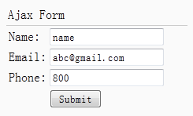

# jQuery EasyUI 表单 - 创建异步提交表单

本教程向您展示如何通过 easyui 提交一个表单（Form）。我们创建一个带有 name、email 和 phone 字段的表单。通过使用 easyui 表单（form）插件来改变表单（form）为 ajax 表单（form）。表单（form）提交所有字段到后台服务器，服务器处理和发送一些数据返回到前端页面。我们接收返回数据，并将它显示出来。



#### 创建表单（Form）

```
	<div style="padding:3px 2px;border-bottom:1px solid #ccc">Ajax Form</div>
	<form id="ff" action="form1_proc.php" method="post">
		<table>
			<tr>
				<td>Name:</td>
				<td><input name="name" type="text"></input></td>
			</tr>
			<tr>
				<td>Email:</td>
				<td><input name="email" type="text"></input></td>
			</tr>
			<tr>
				<td>Phone:</td>
				<td><input name="phone" type="text"></input></td>
			</tr>
			<tr>
				<td></td>
				<td><input type="submit" value="Submit"></input></td>
			</tr>
		</table>
	</form>

```

#### 改变为 Ajax 表单

```
	$('#ff').form({
		success:function(data){
			$.messager.alert('Info', data, 'info');
		}
	});

```

#### 服务器端代码

form1_proc.php

```
	$name = $_POST['name'];
	$email = $_POST['email'];
	$phone = $_POST['phone'];

	echo "Your Name: $name <br/> Your Email: $email <br/> Your Phone: $phone";

```

## 下载 jQuery EasyUI 实例

[jeasyui-form-form1.zip](/try/jeasyui/download/jeasyui-form-form1.zip)

 