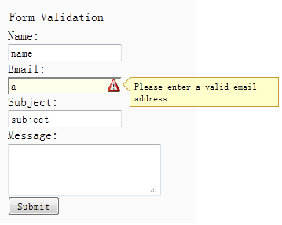

# jQuery EasyUI 表单 - 表单验证

本教程将向您展示如何验证一个表单。easyui 框架提供一个 validatebox 插件来验证一个表单。在本教程中，我们将创建一个联系表单，并应用 validatebox 插件来验证表单。然后您可以根据自己的需求来调整这个表单。



#### 创建表单（form）

让我们创建一个简单的联系表单，带有 name、email、subject 和 message 字段：

```
	<div style="padding:3px 2px;border-bottom:1px solid #ccc">Form Validation</div>
	<form id="ff" method="post">
		<div>
			<label for="name">Name:</label>
			<input class="easyui-validatebox" type="text" name="name" required="true"></input>
		</div>
		<div>
			<label for="email">Email:</label>
			<input class="easyui-validatebox" type="text" name="email" required="true" validType="email"></input>
		</div>
		<div>
			<label for="subject">Subject:</label>
			<input class="easyui-validatebox" type="text" name="subject" required="true"></input>
		</div>
		<div>
			<label for="message">Message:</label>
			&lt;textarea name="message" style="height:60px;"&gt;&lt;/textarea&gt;
		</div>
		<div>
			<input type="submit" value="Submit">
		</div>
	</form>

```

我们添加一个样式名为 easyui-validatebox 到 input 标记，所以 input 标记将根据 validType 属性应用验证。

#### 当表单无效时阻止表单提交

当用户点击表单的 submit 按钮时，如果表单是无效的，我们应该阻止表单提交。

```
	$('#ff').form({
		url:'form3_proc.php',
		onSubmit:function(){
			return $(this).form('validate');
		},
		success:function(data){
			$.messager.alert('Info', data, 'info');
		}
	});

```

如果表单是无效的，将显示一个提示信息。

## 下载 jQuery EasyUI 实例

[jeasyui-form-form3.zip](/try/jeasyui/download/jeasyui-form-form3.zip)

 