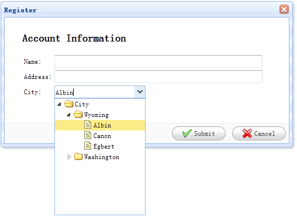

# jQuery EasyUI 表单 - 创建树形下拉框

树形下拉框（ComboTree）是一个带有下列树形结构（Tree）的下拉框（ComboBox）。它可以作为一个表单字段进行使用，可以提交给远程服务器。

在本教程中，我们将要创建一个注册表单，带有 name、address、city 字段。city 字段是一个树形下拉框（ComboTree）字段，在里面用户可以下拉树面板（tree panel），并选择一个特定的城市。



#### 创建表单（Form）

```
	<div id="dlg" class="easyui-dialog" style="width:500px;height:250px;padding:10px 30px;"
			title="Register" buttons="#dlg-buttons">
		<h2>Account Information</h2>
		<form id="ff" method="post">
			<table>
				<tr>
					<td>Name:</td>
					<td><input type="text" name="name" style="width:350px;"/></td>
				</tr>
				<tr>
					<td>Address:</td>
					<td><input type="text" name="address" style="width:350px;"/></td>
				</tr>
				<tr>
					<td>City:</td>
					<td><select class="easyui-combotree" url="data/city_data.json" name="city" style="width:156px;"/></td>
				</tr>
			</table>
		</form>
	</div>
	<div id="dlg-buttons">
		<a href="#" class="easyui-linkbutton" iconCls="icon-ok" onclick="savereg()">Submit</a>
		<a href="#" class="easyui-linkbutton" iconCls="icon-cancel" onclick="javascript:$('#dlg').dialog('close')">Cancel</a>
	</div>

```

从上面的代码可以看到，我们为一个名为 'city' 的树形下拉框（ComboTree）字段设置了一个 url 属性，这个字段可以从远程服务器检索树形结构（Tree）数据。请注意，这个字段有一个样式名字叫 'easyui-combotree'，所以我们不需要写任何的 js 代码，树形下拉框（ComboTree）字段将自动渲染。

## 下载 jQuery EasyUI 实例

[jeasyui-form-form2.zip](/try/jeasyui/download/jeasyui-form-form2.zip)

 