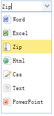

# jQuery EasyUI 表单 - 格式化下拉框

本教程向您展示如何创建一个简单的下拉框（Combobox），让它在下拉框中显示图片项。您可以在下拉框（combobox）上使用 formatter 函数来告诉它如何格式化每一个条目。



#### 创建图像下拉框（Combobox）

```
	<input id="cc" style="width:100px"
			url="data/combobox_data.json"
			valueField="id" textField="text">
	</input>

```

```
	$('#cc').combobox({
		formatter:function(row){
			var imageFile = 'images/' + row.icon;
			return '<span class="item-text">'+row.text+'</span>';
		}
	});

```

## 下载 jQuery EasyUI 实例

[jeasyui-form-form4.zip](/try/jeasyui/download/jeasyui-form-form4.zip)

 