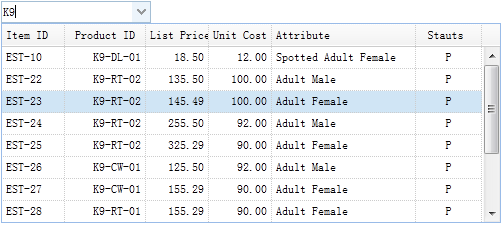

# jQuery EasyUI 表单 - 过滤下拉数据网格

下拉数据网格（Combogrid）组件和下拉框（Combobox）组件的共同点是，除了都具有下拉面板以外，它们都是基于数据网格（Datagrid）的。 下拉数据网格（Combogrid）组件可以过滤、分页，并具有其他一些数据网格（Datagrid）的功能。 本教程向您展示如何在一个下拉数据网格（Combogrid）组件中过滤数据记录。



#### 创建下拉数据网格（Combogrid）

```
<input id="cg" style="width:150px">

```

```
$('#cg').combogrid({
	panelWidth:500,
	url: 'form5_getdata.php',
	idField:'itemid',
	textField:'productid',
	mode:'remote',
	fitColumns:true,
	columns:[[
		{field:'itemid',title:'Item ID',width:60},
		{field:'productid',title:'Product ID',align:'right',width:80},
		{field:'listprice',title:'List Price',align:'right',width:60},
		{field:'unitcost',title:'Unit Cost',align:'right',width:60},
		{field:'attr1',title:'Attribute',width:150},
		{field:'status',title:'Stauts',align:'center',width:60}
	]]
});

```

下拉数据网格（Combogrid）组件应该定义 'idField' 和 'textField' 属性。 'idField' 属性存储组件值，'textField' 属性在 input 文本框中显示文本消息。 下拉数据网格（Combogrid）组件可以以 'local' 或 'remote' 模式过滤记录。 在远程（remote）模式中，当用户输入字符到 input 文本框中，下拉数据网格（Combogrid）将发送 'q' 参数到远程服务器。

#### 服务器端代码

form5_getdata.php

```
$q = isset($_POST['q']) ? strval($_POST['q']) : '';

include 'conn.php';

$rs = mysql_query("select * from item where itemid like '%$q%' or productid like '%$q%'");
$rows = array();
while($row = mysql_fetch_assoc($rs)){
	$rows[] = $row;
}
echo json_encode($rows);

```

## 下载 jQuery EasyUI 实例

[jeasyui-form-form5.zip](/try/jeasyui/download/jeasyui-form-form5.zip)

 