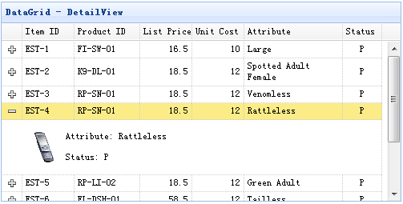
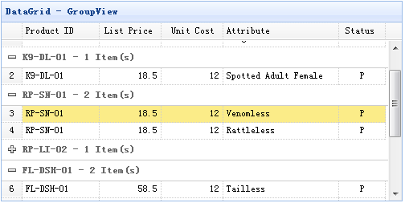
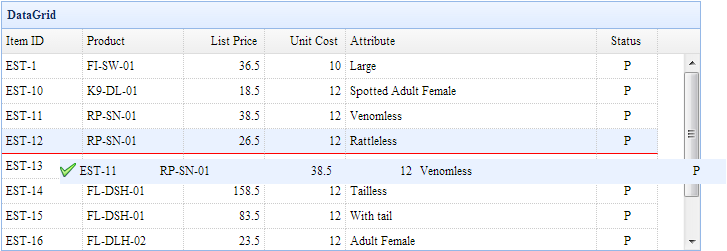
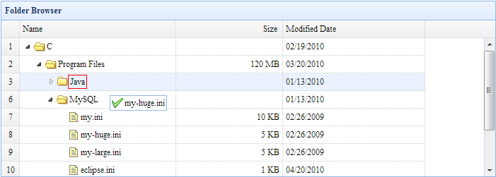
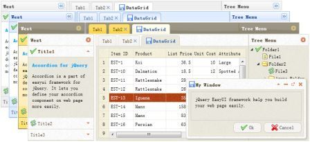

# jQuery EasyUI 扩展

#### [Portal（制作图表、列表、球形图等）](ext-portal.html)

#### [数据网格视图（DataGrid View）](ext-datagridview.html)

|  |
|  |

#### [可编辑的数据网格（Editable DataGrid）](ext-edatagrid.html)

#### [可编辑的树（Editable Tree）](ext-etree.html)

#### [数据网格行过滤（DataGrid Filter Row）](ext-datagrid-filter.html)

#### [数据网格行拖放（Drag and Drop Rows in DataGrid）](ext-datagrid-dnd.html)

#### [树形网格行拖放（Drag and Drop Rows in TreeGrid）](ext-treegrid-dnd.html)

#### [主题（Themes）](ext-themes.html)

#### [DWR 加载器（DWR Loader）](ext-dwrloader.html)

#### [RTL 支持（RTL support）](ext-rtl.html)

#### [Ribbon](ext-ribbon.html)

  
