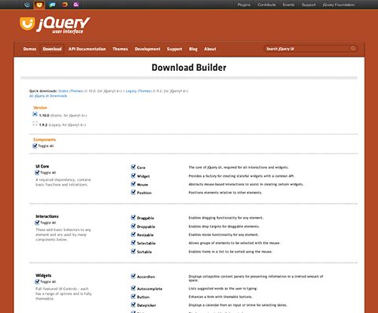

# jQuery UI 下载

一旦您对 jQuery UI 有了基本了解，您就可以亲自尝试一下。请从 jQuery UI 网站上的 [Download Builder（下载生成器）](//jqueryui.com/download/) 页面下载 jQuery UI 的副本。

## 创建自定义 jQuery UI 下载

jQuery UI 的下载生成器（Download Builder）允许您选择您需要下载的组件，为项目获取一个自定义的库版本。创建自定义 jQuery UI 下载需要以下三个步骤：

### 步骤 1：选择您需要的组件

下载生成器（Download Builder）页面的第一栏列出了 jQuery UI 所有的 JavaScript 组件分类：核心（UI Core）、交互部件（Interactions）、小部件（Widgets）和效果库（Effects）。jQuery UI 中的一些组件依赖于其他组件，当选中这些组件时，它所依赖的其他组件也都会自动被选中。您所选的组件将会合并到一个 jQuery UI JavaScript 文件。

### 步骤 2：选择一个主题或者自定义一个主题

在下载生成器（Download Builder）页面，您将看到一个文本框，列出了一系列为 jQuery UI 小部件预先设计的主题。您可以从这些提供的主题中选择一个，也可以使用 ThemeRoller 自定义一个主题（详见后面章节的讲解）。

**高级主题设置：** _下载生成器（Download Builder）的主题部分也为主题提供了一些高级配置设置。如果您打算在一个页面上使用多个主题，这些字段会派上用场。如果您打算在一个页面上只使用一个主题，那么您完全可以跳过这些设置。_

### 步骤 3：选择 jQuery UI 的版本

在下载生成器（Download Builder）中，最后一步是选择一个版本号。这个步骤很重要，因为 jQuery UI 的版本是配合特定的 jQuery 版本设计的。目前的版本有：

*   jQuery UI 1.10.2 – 要求 jQuery 1.6 及以上版本。
*   jQuery UI 1.9.2 – 要求 jQuery 1.6 及以上版本。

### 点击 Download 按钮进行下载！

点击 Download 按钮，完成下载。您将得到一个包含您所选组件的自定义 zip 文件。

