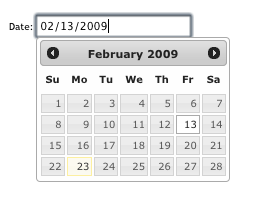

# jQuery UI 使用

一旦您下载了 jQuery UI，您将得到一个 zip 压缩包，包含下列文件：

*   `/css/`
*   `/development-bundle/`
*   `/js/`
*   `index.html`

## 在网页上使用 jQuery UI

在文本编辑器中打开 `index.html`，您将看到引用了一些外部文件：主题、jQuery 和 jQuery UI。通常情况下，您需要在页面中引用这三个文件，以便使用 jQuery UI 的窗体小部件和交互部件：

```
<link rel="stylesheet" href="css/themename/jquery-ui.custom.css" />
<script src="js/jquery.min.js"></script>
<script src="js/jquery-ui.custom.min.js"></script>

```

一旦您引用了这些必要的文件，您就能向您的页面添加一些 jQuery 小部件。比如，要制作一个日期选择器（datepicker）小部件，您需要向页面添加一个文本输入框，然后再调用 `.datepicker()`，如下所示：

**HTML:**

```
<input type="text" name="date" id="date" />
```

**JavaScript:**

```
$( "#date" ).datepicker();
```



如需查看 jQuery UI 小部件和交互部件的实例演示，请访问 [jQuery UI 实例](jqueryui-examples.html)。

