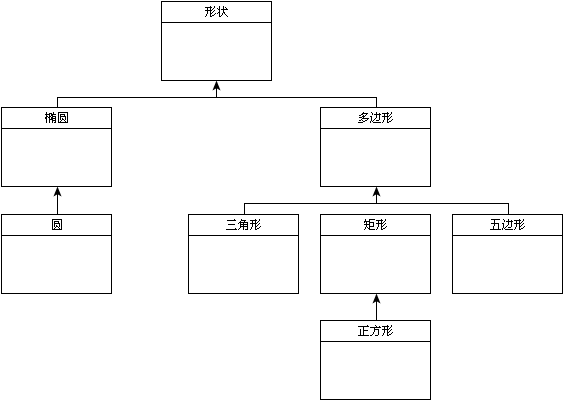

# ECMAScript 继承机制实例

**本节使用一个经典的例子解释 ECMAScript 的继承机制。**

## 继承机制实例

说明继承机制最简单的方式是，利用一个经典的例子 - 几何形状。实际上，几何形状只有两种，即椭圆形（是圆形的）和多边形（具有一定数量的边）。圆是椭圆的一种，它只有一个焦点。三角形、矩形和五边形都是多边形的一种，具有不同数量的边。正方形是矩形的一种，所有的边等长。这就构成了一种完美的继承关系。

在这个例子中，形状（Shape）是椭圆形（Ellipse）和多边形（Polygon）的基类（base class）（所有类都由它继承而来）。椭圆具有一个属性 _foci_，说明椭圆具有的焦点的个数。圆形（Circle）继承了椭圆形，因此圆形是椭圆形的子类（subclass），椭圆形是圆形的超类（superclass）。同样，三角形（Triangle）、矩形（Rectangle）和五边形（Pentagon）都是多边形的子类，多边形是它们的超类。最后，正方形（Square）继承了矩形。

最好用图来解释这种继承关系，这是 UML（统一建模语言）的用武之地。UML 的主要用途之一是，可视化地表示像继承这样的复杂对象关系。下面的图示是解释 Shape 和它的子类之间关系的 UML 图示：

在 UML 中，每个方框表示一个类，由类名说明。三角形 、矩形和五边形顶部的线段汇集在一起，指向形状，说明这些类都由形状继承而来。同样，从正方形指向矩形的箭头说明了它们之间的继承关系。
