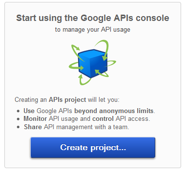
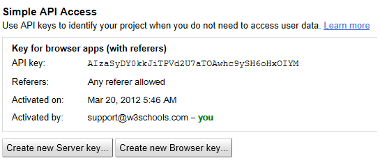

# Google 地图API Key

开始学习本教程前，你需要拥有一个免费的 Google 地图 API key。

## 开始学习？

开始学习本教程前，你需要在Google上申请一个指定的API key。

通过以下步骤我们可以免费获取 API key 。

访问 [https://code.google.com/apis/console/](https://code.google.com/apis/console/), 使用你的Google账号登陆。

登陆后会出现如下界面：

点击 "Create Project" 按钮。

在服务列表中找到 **Google Maps API v3,** 然后点击 "off"（关闭） 让其开启该服务器

在下一个步骤中，选择"I Agree..." 然后点击 "Accept" 按钮。 现在你在服务列表中应该就可以看到 Google Maps API v3 已经变为 "on"（开启）状态。

接着在左侧菜单中点击 "API Access" ，在右侧栏中将看到以下提示 "Create an OAuth 2.0 client id..."。

点击 "Create an OAuth 2.0 client id..."，将弹出一个表单，表单需要你填入你的项目名称，项目图片或者logo，然后点击 "Next" 按钮。

然后，我们需要选择应用类型 ("Web application" ：网站应用), 然后填写你的站点地址，之后点击 "Create Client Id" 按钮即可。

最后我们就可以得到我们需要的 API key,如下图所示：

**注意：** 保存你的API key！ ( 在填写的指定 URL 中开发所有的 Google 地图应用你需要使用该API key)。
